# 500+ AI Agents Projects - Architecture Diagrams

## Table of Contents
1. [AI Agents Ecosystem Overview](#1-ai-agents-ecosystem-overview)
2. [Industry Use Cases Map](#2-industry-use-cases-map)
3. [Framework Architecture](#3-framework-architecture)
4. [Agent Design Patterns](#4-agent-design-patterns)
5. [Implementation Flow](#5-implementation-flow)
6. [Interaction Diagrams](#6-interaction-diagrams)

---

## 1. AI Agents Ecosystem Overview

### 1.1 Complete Ecosystem Map

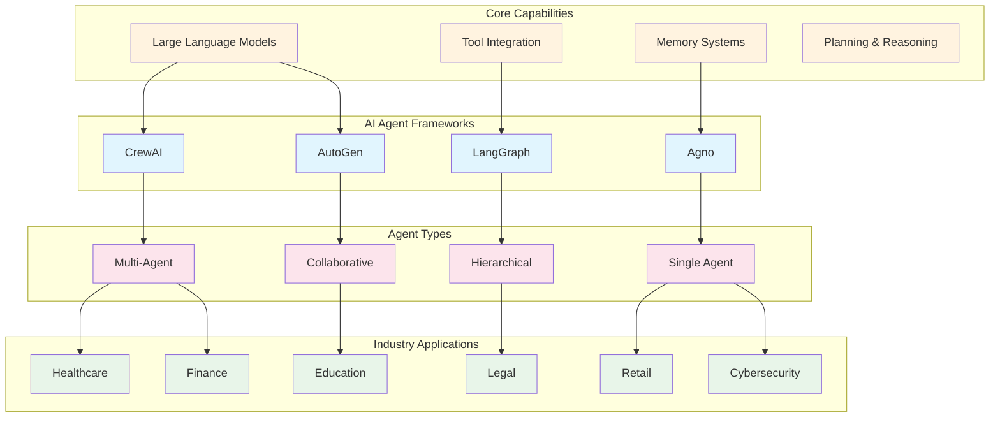
```mermaid
graph TD
    subgraph "AI Agent Frameworks"
        CREWAI[CrewAI]
        AUTOGEN[AutoGen]
        LANGGRAPH[LangGraph]
        AGNO[Agno]
    end

    subgraph "Core Capabilities"
        LLM[Large Language Models]
        TOOLS[Tool Integration]
        MEMORY[Memory Systems]
        PLANNING[Planning & Reasoning]
    end

    subgraph "Industry Applications"
        HEALTH[Healthcare]
        FINANCE[Finance]
        EDUCATION[Education]
        RETAIL[Retail]
        LEGAL[Legal]
        SECURITY[Cybersecurity]
    end

    subgraph "Agent Types"
        SINGLE[Single Agent]
        MULTI[Multi-Agent]
        HIERARCHICAL[Hierarchical]
        COLLABORATIVE[Collaborative]
    end

    CREWAI --> MULTI
    AUTOGEN --> COLLABORATIVE
    LANGGRAPH --> HIERARCHICAL
    AGNO --> SINGLE
    
    LLM --> CREWAI
    LLM --> AUTOGEN
    TOOLS --> LANGGRAPH
    MEMORY --> AGNO
    
    MULTI --> HEALTH
    MULTI --> FINANCE
    COLLABORATIVE --> EDUCATION
    HIERARCHICAL --> LEGAL
    SINGLE --> RETAIL
    SINGLE --> SECURITY

    classDef framework fill:#e1f5fe
    classDef capability fill:#fff3e0
    classDef industry fill:#e8f5e9
    classDef type fill:#fce4ec
    
    class CREWAI,AUTOGEN,LANGGRAPH,AGNO framework
    class LLM,TOOLS,MEMORY,PLANNING capability
    class HEALTH,FINANCE,EDUCATION,RETAIL,LEGAL,SECURITY industry
    class SINGLE,MULTI,HIERARCHICAL,COLLABORATIVE type
```

### 1.2 Agent Architecture Overview

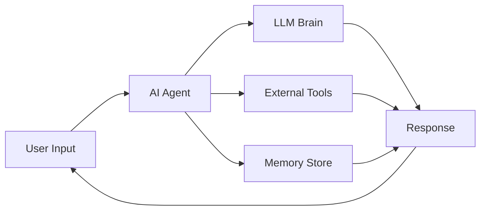
```mermaid
graph LR
    USER[User Input] --> AGENT[AI Agent]
    AGENT --> LLM[LLM Brain]
    AGENT --> TOOLS[External Tools]
    AGENT --> MEMORY[Memory Store]
    LLM --> RESPONSE[Response]
    TOOLS --> RESPONSE
    MEMORY --> RESPONSE
    RESPONSE --> USER
```

---

## 2. Industry Use Cases Map

### 2.1 Healthcare Agents

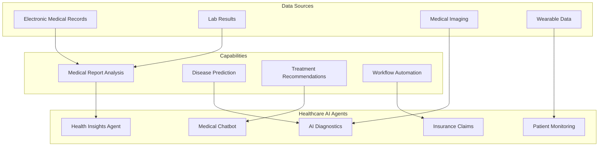
```mermaid
flowchart TB
    subgraph "Healthcare AI Agents"
        HIA[Health Insights Agent]
        DIAG[AI Diagnostics]
        MONITOR[Patient Monitoring]
        CLAIM[Insurance Claims]
        CHAT[Medical Chatbot]
    end

    subgraph "Capabilities"
        ANALYZE[Medical Report Analysis]
        PREDICT[Disease Prediction]
        RECOMMEND[Treatment Recommendations]
        AUTOMATE[Workflow Automation]
    end

    subgraph "Data Sources"
        EMR[Electronic Medical Records]
        LAB[Lab Results]
        IMAGING[Medical Imaging]
        WEARABLE[Wearable Data]
    end

    EMR --> ANALYZE
    LAB --> ANALYZE
    IMAGING --> DIAG
    WEARABLE --> MONITOR
    
    ANALYZE --> HIA
    PREDICT --> DIAG
    RECOMMEND --> CHAT
    AUTOMATE --> CLAIM
```

### 2.2 Finance Agents

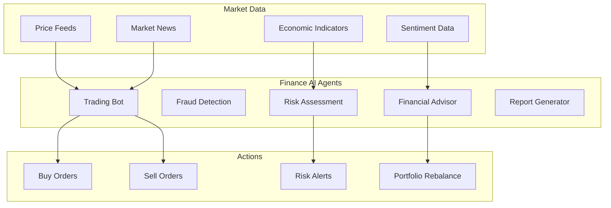
```mermaid
flowchart TB
    subgraph "Finance AI Agents"
        TRADING[Trading Bot]
        FRAUD[Fraud Detection]
        ADVISOR[Financial Advisor]
        RISK[Risk Assessment]
        REPORT[Report Generator]
    end

    subgraph "Market Data"
        PRICE[Price Feeds]
        NEWS[Market News]
        SENTIMENT[Sentiment Data]
        ECONOMIC[Economic Indicators]
    end

    subgraph "Actions"
        BUY[Buy Orders]
        SELL[Sell Orders]
        ALERT[Risk Alerts]
        PORTFOLIO[Portfolio Rebalance]
    end

    PRICE --> TRADING
    NEWS --> TRADING
    SENTIMENT --> ADVISOR
    ECONOMIC --> RISK
    
    TRADING --> BUY
    TRADING --> SELL
    RISK --> ALERT
    ADVISOR --> PORTFOLIO
```

### 2.3 Industry Coverage Map

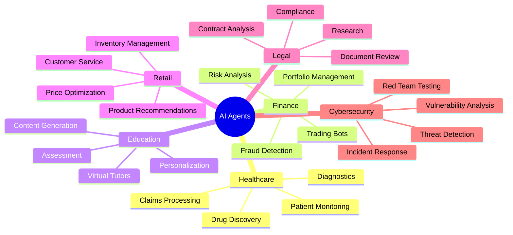
```mermaid
mindmap
    root((AI Agents))
        Healthcare
            Diagnostics
            Patient Monitoring
            Claims Processing
            Drug Discovery
        Finance
            Trading Bots
            Fraud Detection
            Risk Analysis
            Portfolio Management
        Education
            Virtual Tutors
            Content Generation
            Assessment
            Personalization
        Retail
            Product Recommendations
            Customer Service
            Inventory Management
            Price Optimization
        Legal
            Document Review
            Contract Analysis
            Compliance
            Research
        Cybersecurity
            Threat Detection
            Incident Response
            Vulnerability Analysis
            Red Team Testing
```

---

## 3. Framework Architecture

### 3.1 CrewAI Architecture

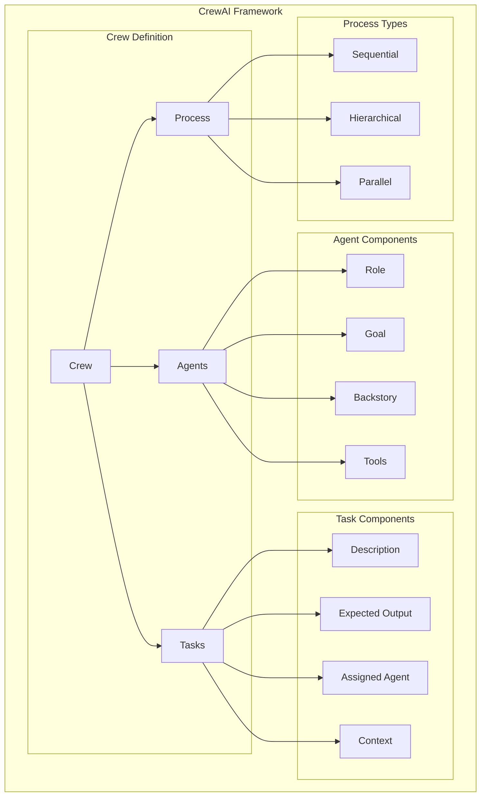
```mermaid
flowchart TB
    subgraph "CrewAI Framework"
        subgraph "Crew Definition"
            CREW[Crew]
            AGENTS[Agents]
            TASKS[Tasks]
            PROCESS[Process]
        end

        subgraph "Agent Components"
            ROLE[Role]
            GOAL[Goal]
            BACKSTORY[Backstory]
            AGENT_TOOLS[Tools]
        end

        subgraph "Task Components"
            DESCRIPTION[Description]
            EXPECTED[Expected Output]
            TASK_AGENT[Assigned Agent]
            CONTEXT[Context]
        end

        subgraph "Process Types"
            SEQUENTIAL[Sequential]
            HIERARCHICAL[Hierarchical]
            PARALLEL[Parallel]
        end
    end

    CREW --> AGENTS
    CREW --> TASKS
    CREW --> PROCESS
    
    AGENTS --> ROLE
    AGENTS --> GOAL
    AGENTS --> BACKSTORY
    AGENTS --> AGENT_TOOLS
    
    TASKS --> DESCRIPTION
    TASKS --> EXPECTED
    TASKS --> TASK_AGENT
    TASKS --> CONTEXT
    
    PROCESS --> SEQUENTIAL
    PROCESS --> HIERARCHICAL
    PROCESS --> PARALLEL
```

### 3.2 AutoGen Architecture

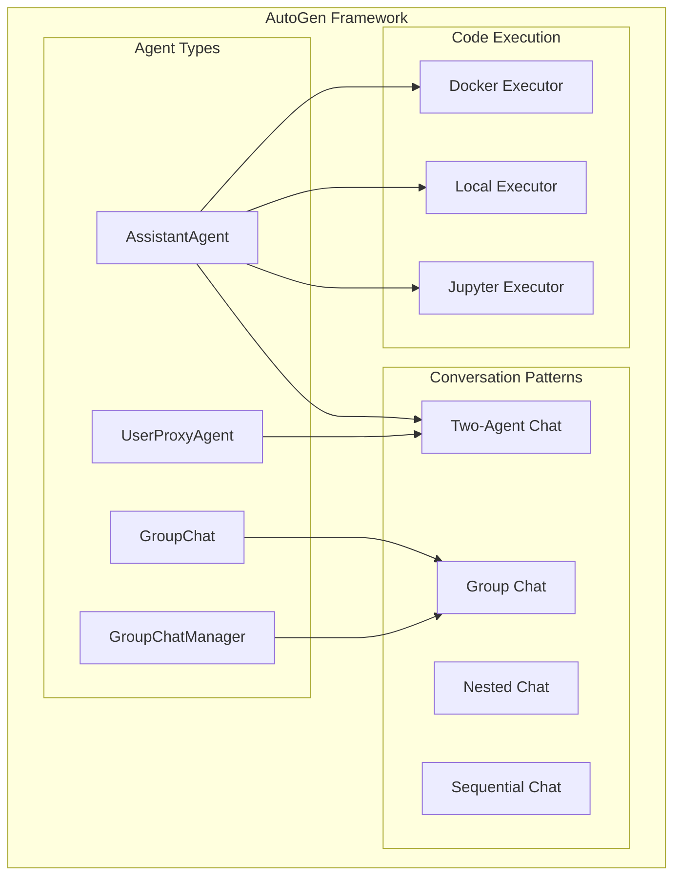
```mermaid
flowchart TB
    subgraph "AutoGen Framework"
        subgraph "Agent Types"
            ASSISTANT[AssistantAgent]
            USER_PROXY[UserProxyAgent]
            GROUP[GroupChat]
            MANAGER[GroupChatManager]
        end

        subgraph "Conversation Patterns"
            TWO_AGENT[Two-Agent Chat]
            GROUP_CHAT[Group Chat]
            NESTED[Nested Chat]
            SEQUENTIAL_CHAT[Sequential Chat]
        end

        subgraph "Code Execution"
            DOCKER[Docker Executor]
            LOCAL[Local Executor]
            JUPYTER[Jupyter Executor]
        end
    end

    ASSISTANT --> TWO_AGENT
    USER_PROXY --> TWO_AGENT
    
    GROUP --> GROUP_CHAT
    MANAGER --> GROUP_CHAT
    
    ASSISTANT --> DOCKER
    ASSISTANT --> LOCAL
    ASSISTANT --> JUPYTER
```

### 3.3 LangGraph Architecture

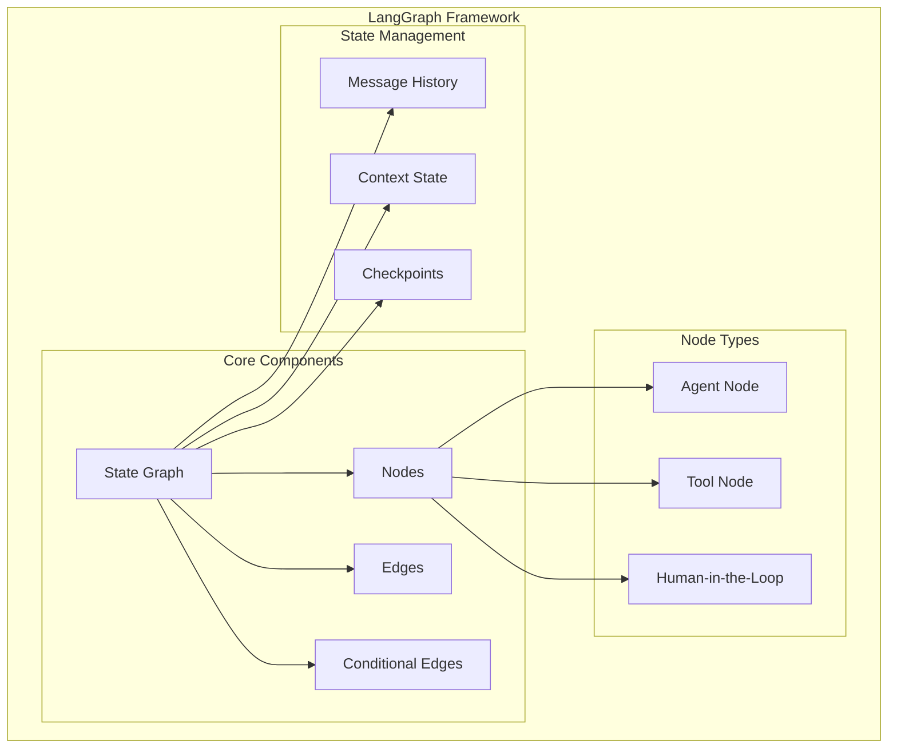
```mermaid
flowchart TB
    subgraph "LangGraph Framework"
        subgraph "Core Components"
            STATE[State Graph]
            NODES[Nodes]
            EDGES[Edges]
            CONDITIONALS[Conditional Edges]
        end

        subgraph "Node Types"
            AGENT_NODE[Agent Node]
            TOOL_NODE[Tool Node]
            HUMAN[Human-in-the-Loop]
        end

        subgraph "State Management"
            MESSAGES[Message History]
            CONTEXT[Context State]
            CHECKPOINTS[Checkpoints]
        end
    end

    STATE --> NODES
    STATE --> EDGES
    STATE --> CONDITIONALS
    
    NODES --> AGENT_NODE
    NODES --> TOOL_NODE
    NODES --> HUMAN
    
    STATE --> MESSAGES
    STATE --> CONTEXT
    STATE --> CHECKPOINTS
```

---

## 4. Agent Design Patterns

### 4.1 Single Agent Pattern

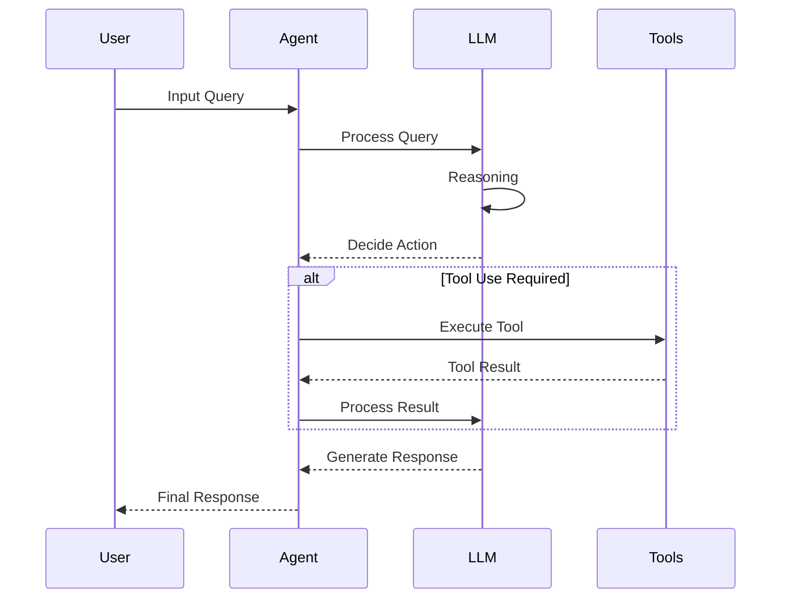
```mermaid
sequenceDiagram
    participant U as User
    participant A as Agent
    participant L as LLM
    participant T as Tools

    U->>A: Input Query
    A->>L: Process Query
    L->>L: Reasoning
    L-->>A: Decide Action
    
    alt Tool Use Required
        A->>T: Execute Tool
        T-->>A: Tool Result
        A->>L: Process Result
    end
    
    L-->>A: Generate Response
    A-->>U: Final Response
```

### 4.2 Multi-Agent Collaboration Pattern

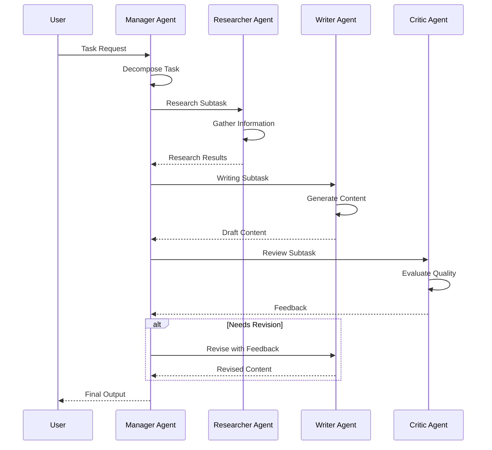
```mermaid
sequenceDiagram
    participant U as User
    participant M as Manager Agent
    participant R as Researcher Agent
    participant W as Writer Agent
    participant C as Critic Agent

    U->>M: Task Request
    M->>M: Decompose Task
    
    M->>R: Research Subtask
    R->>R: Gather Information
    R-->>M: Research Results
    
    M->>W: Writing Subtask
    W->>W: Generate Content
    W-->>M: Draft Content
    
    M->>C: Review Subtask
    C->>C: Evaluate Quality
    C-->>M: Feedback
    
    alt Needs Revision
        M->>W: Revise with Feedback
        W-->>M: Revised Content
    end
    
    M-->>U: Final Output
```

### 4.3 Hierarchical Agent Pattern

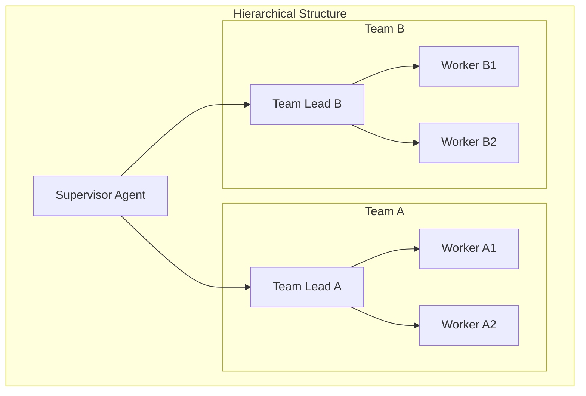
```mermaid
flowchart TD
    subgraph "Hierarchical Structure"
        SUPERVISOR[Supervisor Agent]
        
        subgraph "Team A"
            LEAD_A[Team Lead A]
            WORKER_A1[Worker A1]
            WORKER_A2[Worker A2]
        end
        
        subgraph "Team B"
            LEAD_B[Team Lead B]
            WORKER_B1[Worker B1]
            WORKER_B2[Worker B2]
        end
    end

    SUPERVISOR --> LEAD_A
    SUPERVISOR --> LEAD_B
    
    LEAD_A --> WORKER_A1
    LEAD_A --> WORKER_A2
    
    LEAD_B --> WORKER_B1
    LEAD_B --> WORKER_B2
```

---

## 5. Implementation Flow

### 5.1 Agent Development Flow

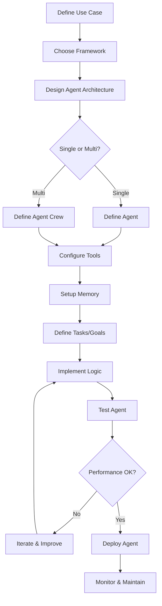
```mermaid
flowchart TD
    START[Define Use Case] --> CHOOSE[Choose Framework]
    CHOOSE --> DESIGN[Design Agent Architecture]
    
    DESIGN --> SINGLE{Single or Multi?}
    
    SINGLE -->|Single| DEF_AGENT[Define Agent]
    SINGLE -->|Multi| DEF_CREW[Define Agent Crew]
    
    DEF_AGENT --> CONFIG_TOOLS[Configure Tools]
    DEF_CREW --> CONFIG_TOOLS
    
    CONFIG_TOOLS --> SETUP_MEMORY[Setup Memory]
    SETUP_MEMORY --> DEFINE_TASKS[Define Tasks/Goals]
    
    DEFINE_TASKS --> IMPLEMENT[Implement Logic]
    IMPLEMENT --> TEST[Test Agent]
    
    TEST --> EVALUATE{Performance OK?}
    
    EVALUATE -->|No| ITERATE[Iterate & Improve]
    ITERATE --> IMPLEMENT
    
    EVALUATE -->|Yes| DEPLOY[Deploy Agent]
    DEPLOY --> MONITOR[Monitor & Maintain]
```

### 5.2 Tool Integration Flow

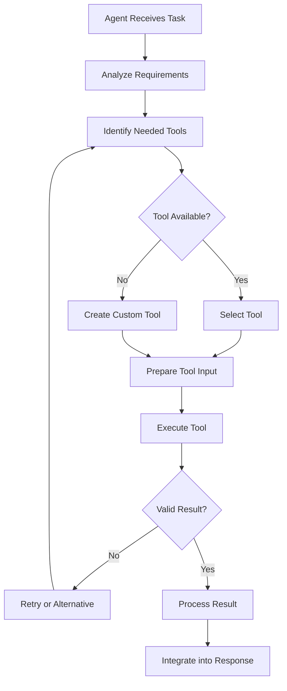
```mermaid
flowchart TD
    AGENT[Agent Receives Task] --> ANALYZE[Analyze Requirements]
    ANALYZE --> IDENTIFY[Identify Needed Tools]
    
    IDENTIFY --> AVAILABLE{Tool Available?}
    
    AVAILABLE -->|Yes| SELECT[Select Tool]
    AVAILABLE -->|No| CREATE[Create Custom Tool]
    
    SELECT --> PREPARE[Prepare Tool Input]
    CREATE --> PREPARE
    
    PREPARE --> EXECUTE[Execute Tool]
    EXECUTE --> VALIDATE{Valid Result?}
    
    VALIDATE -->|No| RETRY[Retry or Alternative]
    RETRY --> IDENTIFY
    
    VALIDATE -->|Yes| PROCESS[Process Result]
    PROCESS --> INTEGRATE[Integrate into Response]
```

### 5.3 Memory System Flow

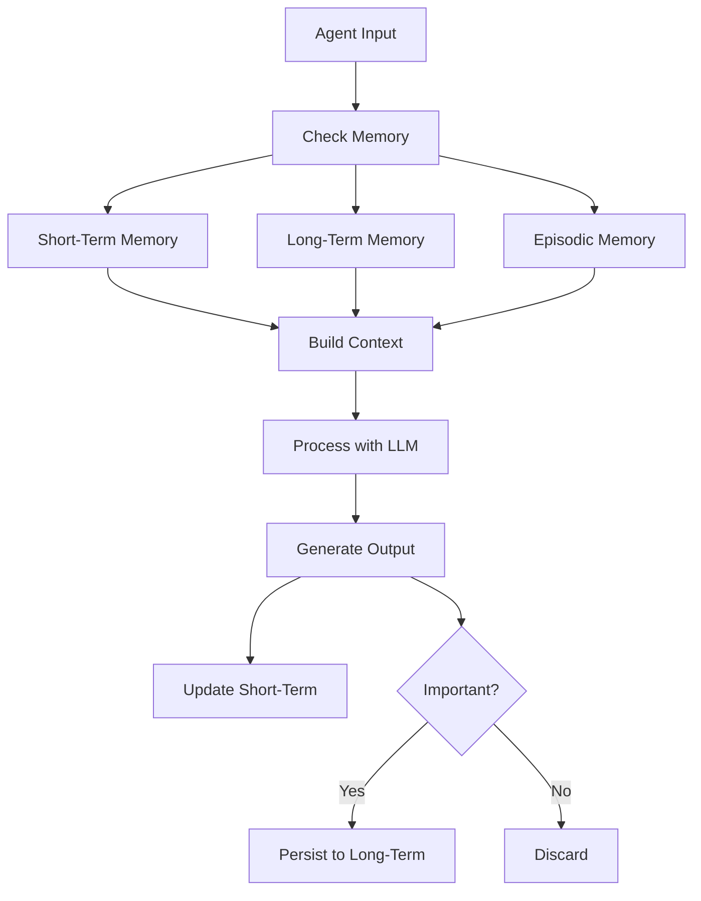
```mermaid
flowchart TD
    INPUT[Agent Input] --> CHECK[Check Memory]
    
    CHECK --> SHORT[Short-Term Memory]
    CHECK --> LONG[Long-Term Memory]
    CHECK --> EPISODIC[Episodic Memory]
    
    SHORT --> CONTEXT[Build Context]
    LONG --> CONTEXT
    EPISODIC --> CONTEXT
    
    CONTEXT --> PROCESS[Process with LLM]
    PROCESS --> OUTPUT[Generate Output]
    
    OUTPUT --> STORE_SHORT[Update Short-Term]
    OUTPUT --> STORE_LONG{Important?}
    
    STORE_LONG -->|Yes| PERSIST[Persist to Long-Term]
    STORE_LONG -->|No| DISCARD[Discard]
```

---

## 6. Interaction Diagrams

### 6.1 CrewAI Example Flow

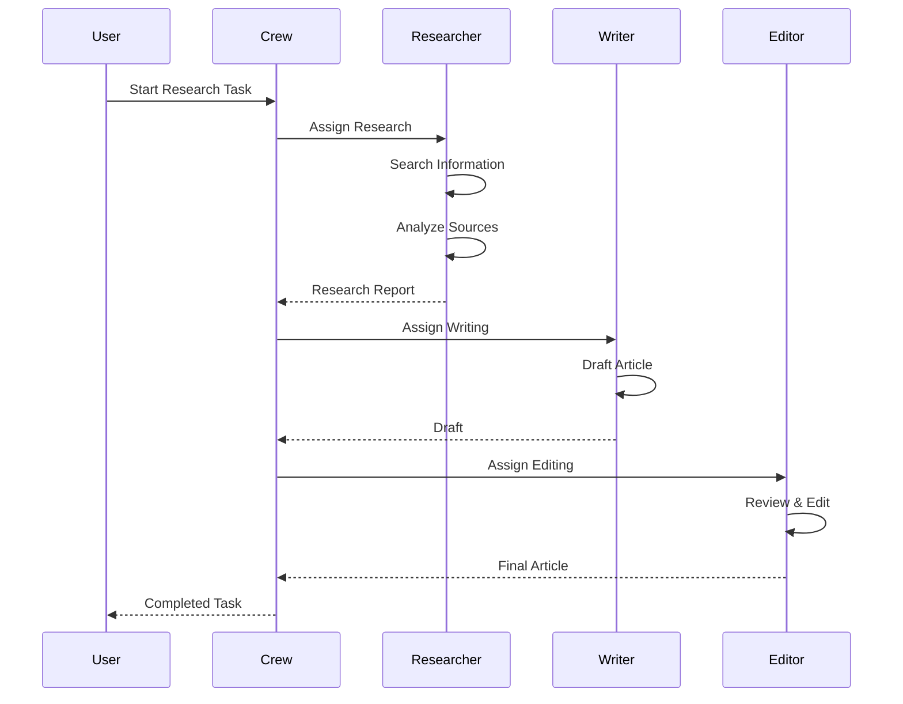
```mermaid
sequenceDiagram
    participant U as User
    participant C as Crew
    participant R as Researcher
    participant W as Writer
    participant E as Editor

    U->>C: Start Research Task
    C->>R: Assign Research
    
    R->>R: Search Information
    R->>R: Analyze Sources
    R-->>C: Research Report
    
    C->>W: Assign Writing
    W->>W: Draft Article
    W-->>C: Draft
    
    C->>E: Assign Editing
    E->>E: Review & Edit
    E-->>C: Final Article
    
    C-->>U: Completed Task
```

### 6.2 Customer Service Agent Flow

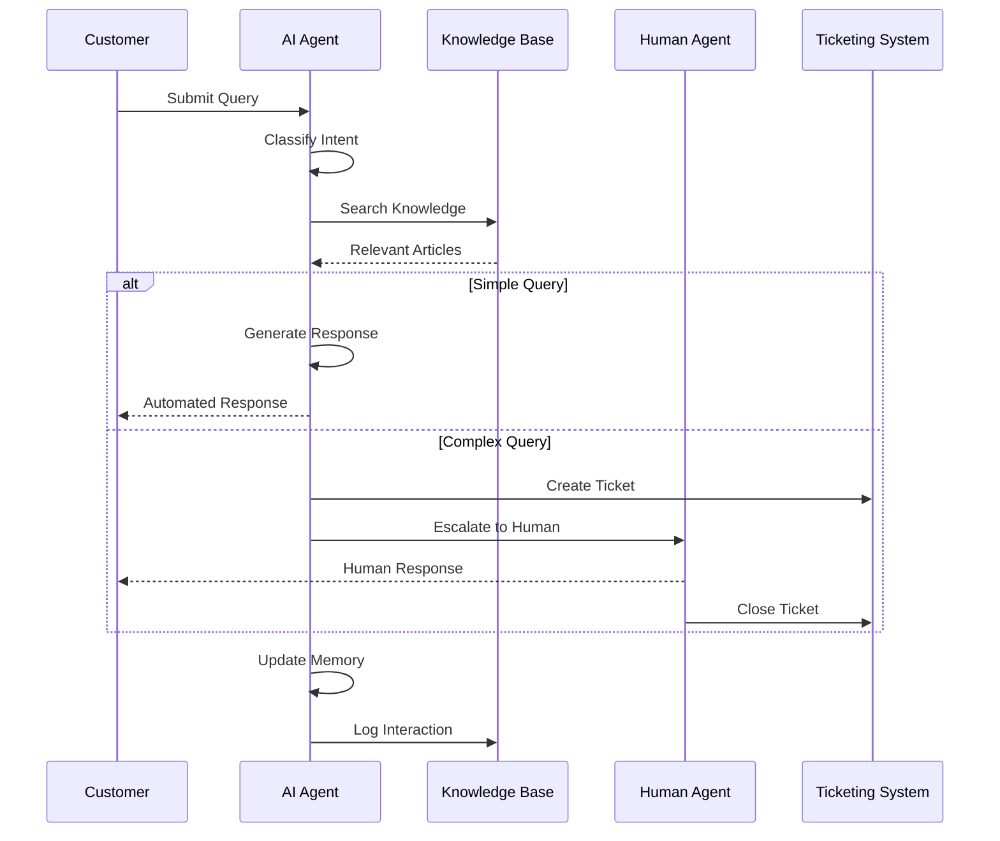
```mermaid
sequenceDiagram
    participant C as Customer
    participant A as AI Agent
    participant K as Knowledge Base
    participant H as Human Agent
    participant T as Ticketing System

    C->>A: Submit Query
    A->>A: Classify Intent
    
    A->>K: Search Knowledge
    K-->>A: Relevant Articles
    
    alt Simple Query
        A->>A: Generate Response
        A-->>C: Automated Response
    else Complex Query
        A->>T: Create Ticket
        A->>H: Escalate to Human
        H-->>C: Human Response
        H->>T: Close Ticket
    end
    
    A->>A: Update Memory
    A->>K: Log Interaction
```

### 6.3 Trading Agent Flow

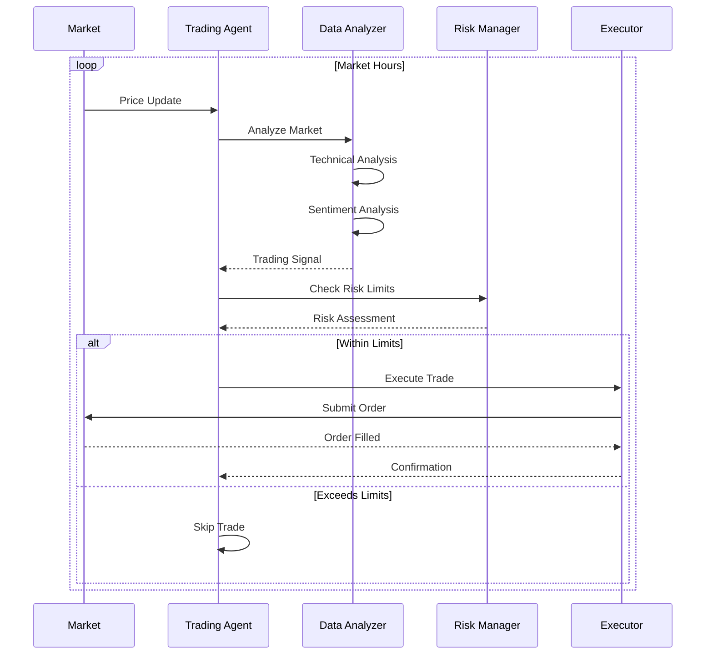
```mermaid
sequenceDiagram
    participant M as Market
    participant A as Trading Agent
    participant D as Data Analyzer
    participant R as Risk Manager
    participant E as Executor

    loop Market Hours
        M->>A: Price Update
        A->>D: Analyze Market
        D->>D: Technical Analysis
        D->>D: Sentiment Analysis
        D-->>A: Trading Signal
        
        A->>R: Check Risk Limits
        R-->>A: Risk Assessment
        
        alt Within Limits
            A->>E: Execute Trade
            E->>M: Submit Order
            M-->>E: Order Filled
            E-->>A: Confirmation
        else Exceeds Limits
            A->>A: Skip Trade
        end
    end
```

---

## 7. Unified Agent Architecture

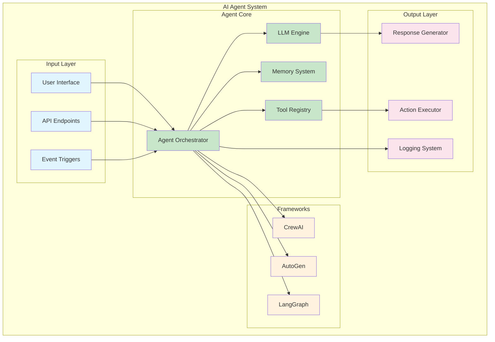
```mermaid
graph TB
    subgraph "AI Agent System"
        subgraph "Input Layer"
            USER[User Interface]
            API[API Endpoints]
            EVENTS[Event Triggers]
        end

        subgraph "Agent Core"
            ORCHESTRATOR[Agent Orchestrator]
            LLM[LLM Engine]
            MEMORY[Memory System]
            TOOLS[Tool Registry]
        end

        subgraph "Frameworks"
            CREWAI[CrewAI]
            AUTOGEN[AutoGen]
            LANGGRAPH[LangGraph]
        end

        subgraph "Output Layer"
            RESPONSE[Response Generator]
            ACTIONS[Action Executor]
            LOGS[Logging System]
        end
    end

    USER --> ORCHESTRATOR
    API --> ORCHESTRATOR
    EVENTS --> ORCHESTRATOR
    
    ORCHESTRATOR --> LLM
    ORCHESTRATOR --> MEMORY
    ORCHESTRATOR --> TOOLS
    
    ORCHESTRATOR --> CREWAI
    ORCHESTRATOR --> AUTOGEN
    ORCHESTRATOR --> LANGGRAPH
    
    LLM --> RESPONSE
    TOOLS --> ACTIONS
    ORCHESTRATOR --> LOGS

    classDef input fill:#e1f5fe
    classDef core fill:#c8e6c9
    classDef framework fill:#fff3e0
    classDef output fill:#fce4ec

    class USER,API,EVENTS input
    class ORCHESTRATOR,LLM,MEMORY,TOOLS core
    class CREWAI,AUTOGEN,LANGGRAPH framework
    class RESPONSE,ACTIONS,LOGS output
```

---

## Usage

View these diagrams in:
- GitHub/GitLab markdown preview
- VS Code with Mermaid extension
- [Mermaid Live Editor](https://mermaid.live/)

## Contributing

When adding new AI agent projects, consider:
1. Which industry category it belongs to
2. Which framework(s) it uses
3. What agent pattern it implements
4. What unique capabilities it offers
